# Vunewbie Data Engineering Platform

---

## Overview

This data engineering project was built to demonstrate the skills and knowledge I acquired from my mentor, combined with my own self-study and exploration during my internship at Pizza 4P's.

The project follows the journey of a fictional startup, **vunewbie**, as it evolves its data architecture from a simple system designed for a small business into a modern, scalable platform fit for a medium-sized enterprise.

### Phase 1: The Startup Era - A Simple ETL Pipeline

In its early days, vunewbie prioritized rapid development and simplicity. They chose **MongoDB** as their OLTP database and designed a straightforward ETL pipeline to handle daily reporting and dashboarding needs. 

The process was as follows:
*   **Staging**: Raw data was extracted into a staging area as `.json` files.
*   **NDS (Normalized Data Store)**: Data was then loaded into a PostgreSQL schema, where it was deduplicated, cleaned, and normalized to 3NF.
*   **DDS (Dimensional Data Store)**: Finally, the cleaned data was loaded into dimension and fact tables in a separate schema within the same PostgreSQL instance. This layer served as the data warehouse for creating simple dashboards in **Superset**. The entire pipeline was automated using **Airflow**.

### The Breaking Point: Challenges of Scale

This initial architecture was effective for its time, offering a fast, cost-efficient solution built on open-source tools. However, as vunewbie grew, the design began to show its limitations:

*   **ACID Compliance**: MongoDB could not provide the same ACID guarantees for transactions as a relational database.
*   **Debugging and Data Science Needs**: The lack of a structured, raw data layer made debugging pipeline failures incredibly difficult. It also meant the AI/DS team had no access to deduplicated raw data for model training.
*   **Historical Data**: The NDS implemented SCD Type 1, overwriting records and erasing historical context. To analyze past data, a new, costly pipeline had to be built to reprocess data from the original `.json` files.
*   **Data Governance**: The DDS was a monolithic structure, with shared tables not organized into specific data marts for each department.
*   **BI Tooling**: While free, **Superset** lacked the advanced features required by the BI/DA teams as their analytical needs grew more complex.

### Phase 2: The Scale-Up - A Modern Lakehouse Architecture

To address these critical challenges, vunewbie adopted a new ELT pipeline based on a modern lakehouse paradigm. This new architecture, inspired by the medallion model, introduced a multi-layered approach:

*   **Data Source**: The legacy MongoDB was replaced with two relational databases, **PostgreSQL** and **MySQL**, built on a newly designed schema.
*   **Landing Layer**: Replacing the old staging area, this layer stores data as **`.parquet`** files. This format was chosen for its superior advantages over `.json`, such as cost-effective compressed storage, optimized columnar reading, and strong compatibility with Spark.
*   **Bronze Layer**: This layer serves as a queryable archive for raw data. It consists of BigQuery **external tables** that act as a metadata layer over the `.parquet` files, allowing engineers to debug pipeline failures using standard SQL.
*   **Silver Staging Layer**: This layer provides raw, deduplicated data, specifically designed to meet the needs of the AI/DS teams who require access to clean, unprocessed data for model training.
*   **Silver Intermediate Layer**: The successor to the old NDS, this layer implements **SCD Type 2** to preserve a full historical record of all changes. This allows for powerful historical analysis without the need to reprocess data from the landing layer.
*   **Gold Curated Layer**: This is the new DDS, now organized into departmental **data marts**. It upserts data from the Silver Intermediate Layer, ensuring that business users always have the latest, most accurate information.
*   **Gold Cube Layer**: This layer contains pre-aggregated data across multiple dimensions, optimized for high-performance dashboarding and visualization.
*   **BI Tool**: The company upgraded to **Tableau**, a powerful, industry-leading BI tool.

This project aims to demonstrate my ability to apply these architectural concepts to build a system that is not only scalable and reusable but also easy to debug and maintain, covering a wide range of real-world data engineering challenges.

---

## Architecture

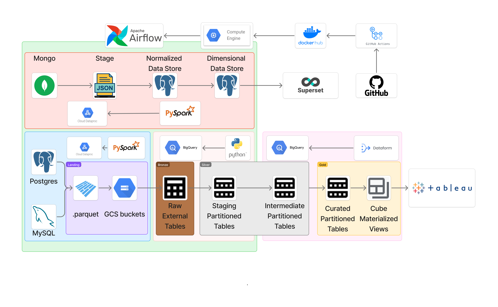

### ETL Pipeline with Traditional Data Warehouse

*   **Data Source**: The original data is from the [Brazilian E-Commerce Public Dataset by Olist](https://www.kaggle.com/datasets/olistbr/brazilian-ecommerce?select=olist_order_items_dataset.csv). The individual `.csv` files were consolidated into collections of multiple documents.
*   **Staging**: Data is extracted 1:1 from the source as `.json` files and stored in GCS buckets.
*   **NDS (Normalized Data Store)**: Data from staging is deduplicated, cleaned, and transformed into 3NF with SCD Type 1.
*   **DDS (Dimensional Data Store)**: Data from the NDS is upserted into dimension and fact tables. A few cube views are also created for user consumption.

### ELT Pipeline with Modern Data Lakehouse

*   **Data Source**: The original data is from the [AdventureWorks sample databases](https://learn.microsoft.com/en-us/sql/samples/adventureworks-install-configure?view=sql-server-ver17&tabs=ssms). The dataset, originally a `.bak` file for SQL Server, was migrated to two databases, PostgreSQL and MySQL, using DBeaver's data migration feature.
*   **Landing**: Data is extracted daily as `.parquet` files and stored in a GCS bucket.
*   **Bronze**: BigQuery external tables serve as a metadata layer over the `.parquet` files, allowing DEs to query them directly as if they were real tables.
*   **Silver Staging**: Data is deduplicated but not yet cleaned, serving the needs of model building. Partitioned tables are used to optimize queries.
*   **Silver Intermediate**: SCD Type 2 is applied to store historical data during the cleaning process. This layer also uses partitioned tables.
*   **Gold Curated**: Partitioned dimension and fact tables are organized into multiple data marts to serve various departments.
*   **Gold Cube**: This layer has the highest query frequency, as users tend to refresh, filter, and sort directly on the dashboard. Therefore, Materialized Views are used to leverage their ability to incrementally add new data while ensuring continuous read access for users.

---

## Data Flow

### CI/CD

*   **Continuous Integration (CI)**: Whenever code is pushed to any branch other than `main`, GitHub Actions automatically triggers four parallel jobs to accelerate the CI process:
    *   **Code Style and Formatting Check**: Uses Python libraries like `black`, `flake8`, and `pylint` to enforce code quality.
    *   **DAG Syntax Validation**: Ensures that all Airflow DAGs are syntactically correct.
    *   **Test Image Build**: Builds a Docker image to verify that it can be created successfully.
    *   **YAML Syntax Validation**: Checks the syntax of all `.yaml` configuration files.

*   **Continuous Deployment (CD)**: Whenever a pull request is merged into the `main` branch, GitHub Actions automates the deployment process:
    *   **Build and Push Image**: Builds the Docker image using the `Dockerfile` and pushes it to Docker Hub.
    *   **Upload PySpark Code**: Uploads the `pyspark/` folder, which contains PySpark code and custom-built libraries, to GCS Buckets.
    *   **Deploy to VM**: SSHes into the Compute Engine VM running the Airflow server, pulls the latest code and Docker image, and restarts the services using `docker compose up`.

### Orchestration

Airflow schedules the DAGs and executes jobs at the specified times.

*   **ETL Pipeline**:
    *   Airflow triggers a Dataproc job to execute a PySpark script, pushing data to GCS Landing buckets.
    *   Airflow then triggers another Dataproc job to deduplicate, clean, transform the data to 3NF, and load it into the **NDS (Normalized Data Store)**.
    *   Finally, Airflow triggers a third Dataproc job to upsert the data into the dimension and fact tables in the **DDS (Dimensional Data Store)**.
    *   The cubes are standard views and do not require separate scheduling.

*   **ELT Pipeline**:
    *   Airflow triggers a Dataproc job to execute a PySpark script, which pushes data to GCS Landing buckets.
    *   Airflow then builds DDL to create or update external tables in the **Bronze** layer. It also compares the schema and sends an email notification to the DE team about new/updated schemas.
    *   Next, Airflow builds a `MERGE` statement to deduplicate data from the Parquet files and upserts it into the **Silver Staging** layer.
    *   Airflow's tasks for this pipeline end here.
    *   A separate Dataform job scheduler triggers a job for BigQuery to clean and load data into the **Silver Intermediate** layer using SCD Type 2 to maintain historical data.
    *   Dataform then triggers another job to load the latest transformed data into the **Gold Curated** layer.
    *   The Materialized Views in the **Gold Cube** layer automatically load new data incrementally, requiring no additional scheduling.

---

## Data Source Guide

### ETL: Olist Legacy Data Source

This section provides a step-by-step guide on how to set up the Olist legacy data source for the ETL pipeline.

1.  **Download the Dataset**: Download the [Brazilian E-Commerce Public Dataset by Olist](https://www.kaggle.com/datasets/olistbr/brazilian-ecommerce?select=olist_order_items_dataset.csv) and place the `.csv` files in the `data_source/mongo/` directory.

2.  **Run the Data Generation Script**: Open the `data_source/mongo/data_generation.ipynb` notebook and run all cells. This script will consolidate the `.csv` files into multiple collections in your MongoDB instance.

    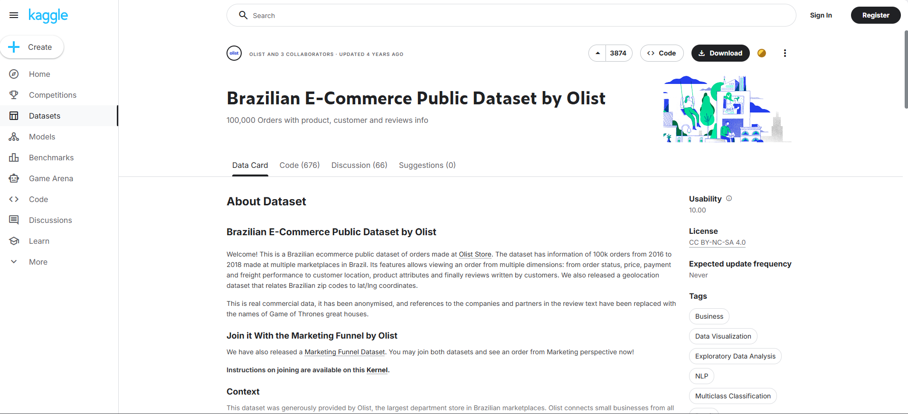

3.  **Verify the Data**: Connect to your MongoDB instance and verify that the collections have been created successfully.

    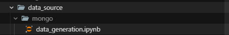

    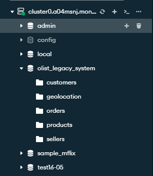

### ELT: AdventureWorks Data Source

This section provides a step-by-step guide on how to set up the AdventureWorks data source for the ELT pipeline.

1.  **Download the Dataset**: Download the AdventureWorks sample database (`.bak` file) from the [official Microsoft documentation](https://learn.microsoft.com/en-us/sql/samples/adventureworks-install-configure?view=sql-server-ver17&tabs=ssms).

    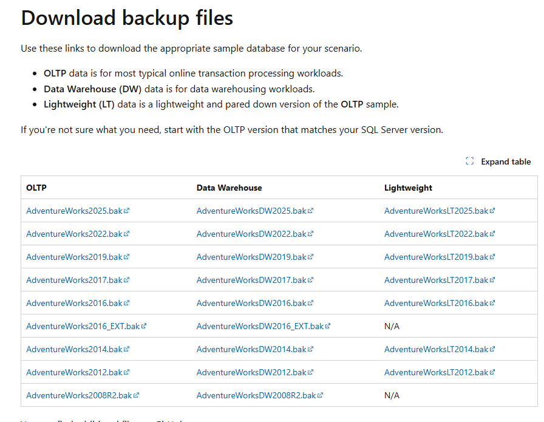

2.  **Restore the Database**: Restore the `.bak` file to your SQL Server instance using SQL Server Management Studio (SSMS).

    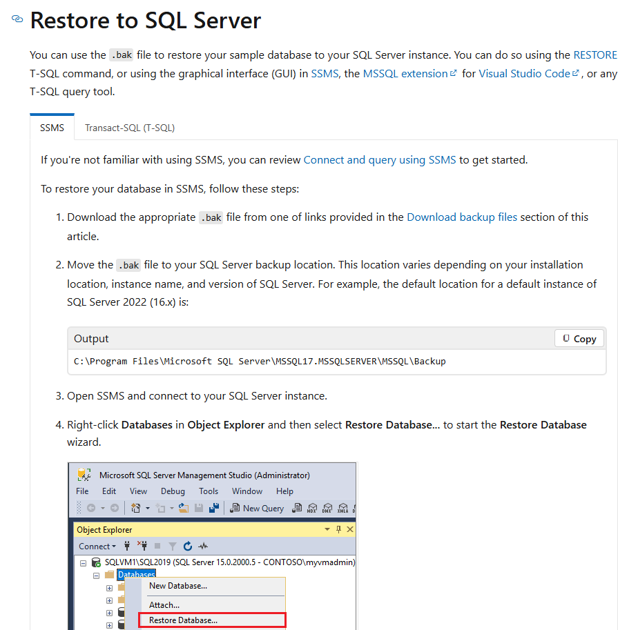
    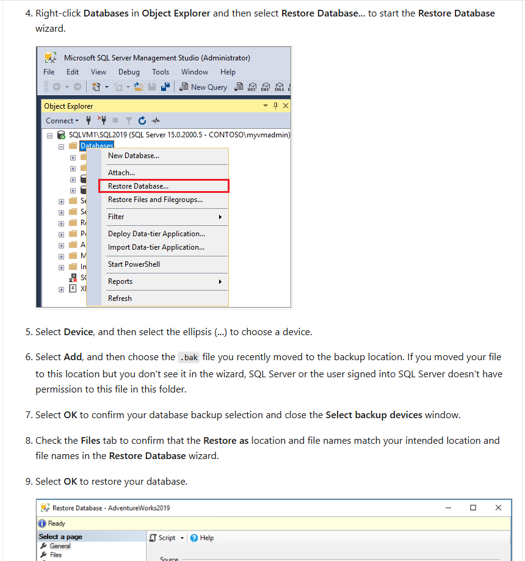
    

3.  **Create Connections**: Use a database tool like DBeaver to create connections to your SQL Server, MySQL, and PostgreSQL instances.

    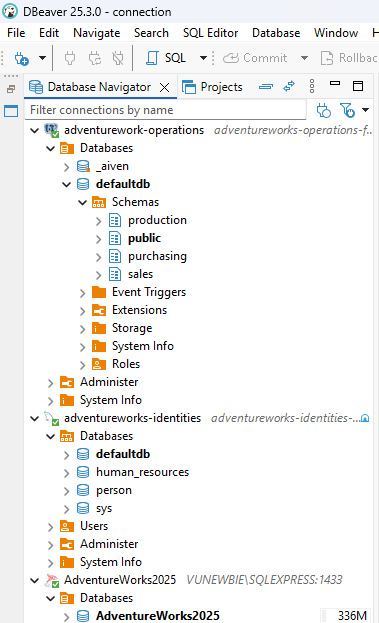

4.  **Migrate the Data**: Use DBeaver's data migration feature to transfer the data from SQL Server to MySQL and PostgreSQL.

    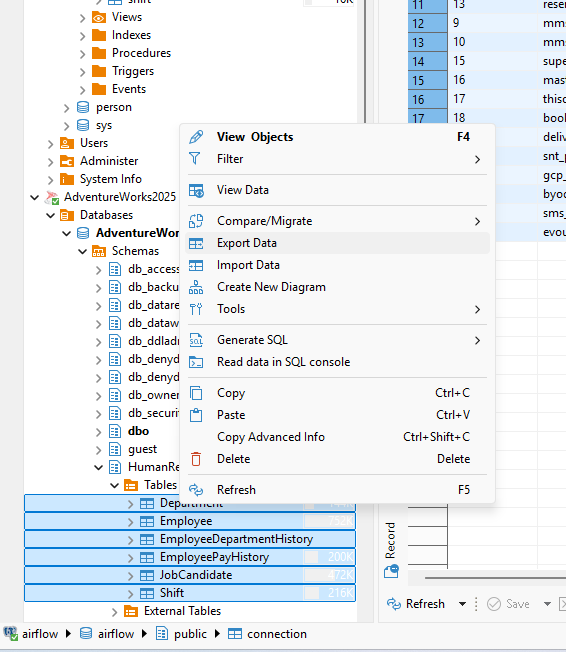
    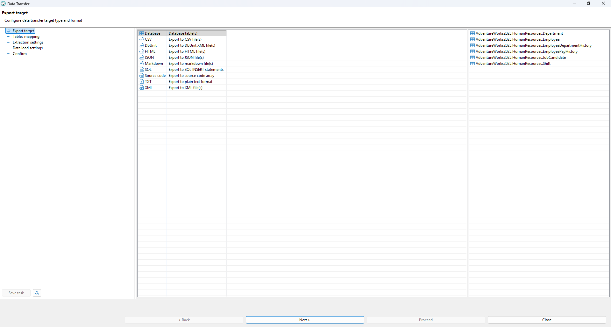
    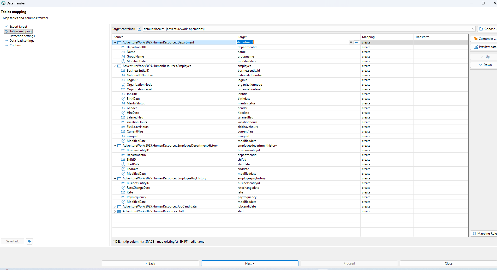
    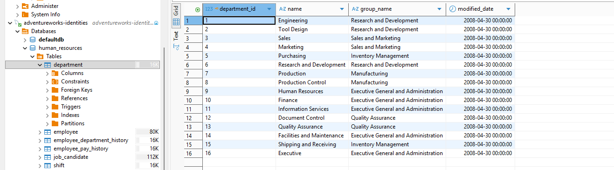