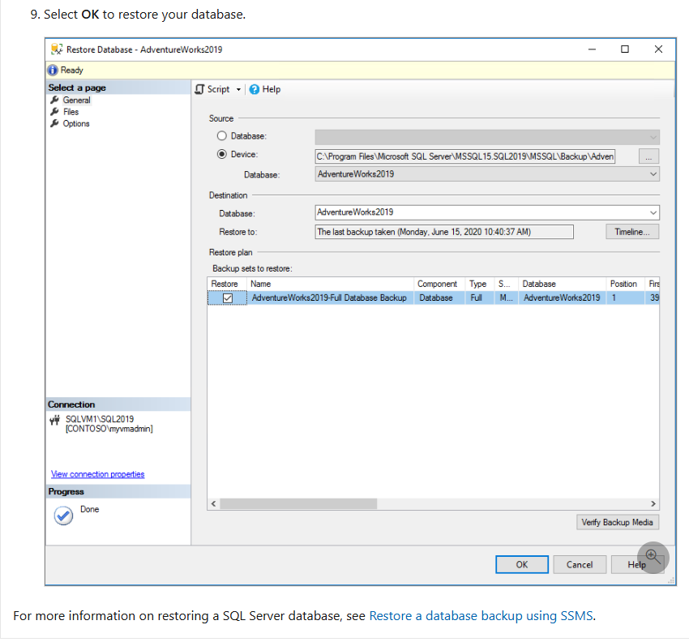

# Vunewbie Data Engineering Platform

---

## Overview

> This is a data engineering project built by me—a **data engineering intern at Pizza 4P's**. The project showcases my self-driven learning journey and unforgettable experiences at Pizza 4P's. To make this project more engaging, I'll tell you the story of **vunewbie**, a business founded by Nguyen Hoang Vu, a young entrepreneur with big dreams.

### The Startup Phase

In the early days of starting his small company, Vu chose **MongoDB** for his NoSQL database to "cram" everything into documents, prioritizing speed and simplicity. He also built a traditional ETL pipeline following a Data Warehouse architecture to serve basic reporting needs.

To minimize costs, Vu decided on:

- **MongoDB** for the OLTP database
- **PySpark** for ingestion and transformation across the entire pipeline
- A single **PostgreSQL** database instance with two schemas for NDS and DDS
- **Superset** for simple dashboards and reports

### Growing Pains

Years later, vunewbie flourished and became one of the largest companies in the country. However, this growth came with challenges:

- MongoDB couldn't meet ACID requirements
- Having only three layers (Staging, NDS, DDS) made data reprocessing extremely difficult, especially with schema evolution issues
- The AI/ML team needed deduplicated raw data for model training but neither NDS nor DDS could provide it
- Superset couldn't meet the increasingly high demands of the DA/BI team
- A single MongoDB instance was overloaded

### The Transformation

Facing these challenges, the Founder and Data Manager decided to design a completely new architecture:

- **MongoDB** was replaced by two relational databases—**MySQL** and **PostgreSQL**
- The architecture shifted from a traditional Data Warehouse to a modern **Lakehouse** architecture that balances both cost and performance
- The data team chose **PySpark** to ingest data from databases into `.parquet` files instead of `.json`
- Data is stored in **Google Cloud Storage**
- **Bronze layer**: raw external tables
- **Silver layer**: Iceberg managed tables at the staging level and partitioned tables at the intermediate level
- **Gold layer**: curated partitioned tables and cube materialized views, visualized using **Tableau**

---

## Architecture

### Legacy Architecture: ETL Pipeline with Traditional Data Warehouse

#### Source

Simulated from the [Brazilian E-Commerce Public Dataset by Olist](https://www.kaggle.com/datasets/olistbr/brazilian-ecommerce/data) by consolidating raw data into documents.

#### Staging

Data is extracted as `.json` files using **PySpark**. Jobs are executed by **Google Cloud Dataproc Serverless** to optimize costs and reduce operational complexity.

#### Normalized Data Store (NDS)

Data from `.json` files is normalized to **3NF**, deduplicated, and cleaned in the `nds` schema of a single PostgreSQL instance.

#### Dimensional Data Store (DDS)

Data is loaded into the data warehouse in a simple **star schema** format. OLAP/cube views are created for Superset to perform visualization.

---

### Modern Architecture: ELT with Modern Lakehouse

#### Source

Simulated from [AdventureWorks sample databases](https://learn.microsoft.com/en-us/sql/samples/adventureworks-install-configure?view=sql-server-ver17&tabs=ssms) by importing data from SQL Server into two databases:

- **`adventureworks-identities`** (MySQL) with two schemas:
  - `person`
  - `human_resources`
- **`adventureworks-operations`** (PostgreSQL) with three schemas:
  - `production`
  - `sales`
  - `purchasing`

#### Landing

Data is extracted as **`.parquet`** files into **Google Cloud Storage** to optimize storage costs and read performance.

#### Bronze

These are **BigQuery external tables**. Data at this layer is write-append only—or more accurately, it's a metadata layer that allows querying data in `.parquet` files as if they were physical tables. This helps the DE team audit data when errors occur.

#### Silver Staging

These are **Iceberg managed tables**. This layer was created to separate deduplication and data transformation. Data is still stored as `.parquet` files, but Iceberg, beyond being a metadata layer, also supports many features such as:

- Automatic schema evolution handling
- Excellent support for various tools like Spark, Trino, etc.

> **Note:** This is the deduplicated raw layer that AI/DS teams need.

#### Silver Intermediate

These are **partitioned tables**. This layer was created for the DE team to clean data in preparation for loading into dimension and fact tables in Gold.

#### Gold Curated

Data at this layer is organized in a **star schema** format. Each department has its own data mart for use. Additionally, there are OLAP tables that are pre-joined together to facilitate querying.

#### Gold Cube

Pre-aggregated data across multiple dimensions using **materialized views**, which will be visualized using **Tableau**.

---

### Orchestration and CI/CD

The CI/CD process is very straightforward:

#### Continuous Integration

Whenever code is pushed to a branch, it automatically:

- Checks code style
- Validates DAG syntax
- Builds images for testing
- Verifies YAML file imports

#### Continuous Deployment

Whenever a pull request is merged into `main`:

1. The image is automatically built and pushed to **Docker Hub**
2. PySpark code is uploaded to the **GCS bucket**
3. **GitHub Actions** SSH into the VM to pull the code and image
4. Server is restarted

---

## Data Source Guide

### MongoDB: Brazilian E-Commerce Dataset (Olist)

This section describes how to simulate the MongoDB data source using the [Brazilian E-Commerce Public Dataset by Olist](https://www.kaggle.com/datasets/olistbr/brazilian-ecommerce/data). The process consolidates multiple CSV files into MongoDB document collections.

#### Step 1: Prepare Geolocation Collection

Load the geolocation dataset and create a standalone collection. Remove duplicates based on zip code prefix, city, and state to ensure unique combinations for merging with customers and sellers.

#### Step 2: Create Customers Collection

Load customer data and merge with geolocation information based on zip code prefix, city, and state. Create a nested `geolocation` field within each customer document. Use a left join to preserve all customers even if geolocation data is missing (simulating real-world data quality issues).

#### Step 3: Create Sellers Collection

Load seller data and merge with geolocation information using the same approach as customers. Create nested `geolocation` fields within seller documents.

#### Step 4: Create Products Collection

Load product data and merge with the product category translation file to enrich category names with English translations. Normalize category names for better matching.

#### Step 5: Create Orders Collection

Load order-related datasets (orders, order items, payments, and reviews). Group items, payments, and reviews by `order_id` and convert them into nested arrays within the order document. Handle missing nested data by replacing NaN values with empty arrays. Convert date columns to proper datetime objects for MongoDB storage.

#### Step 6: Insert into MongoDB

Connect to your MongoDB instance (local or cloud). Clear existing collections to avoid duplicates, then insert all collections using batch insertion (`insert_many`) for better performance.

> **Note:** The complete data generation script is available in `data_source/mongo/data_generation.ipynb`. All required CSV files are located in the `data_source/mongo/` directory.

### AdventureWorks: Relational Databases (MySQL & PostgreSQL)

This section describes how to set up the AdventureWorks sample databases for the modern architecture. The process involves restoring the database from SQL Server and migrating data to MySQL and PostgreSQL.

#### Step 1: Download AdventureWorks Dataset

Download the AdventureWorks dataset in `.bak` format from the [Microsoft Learn documentation](https://learn.microsoft.com/en-us/sql/samples/adventureworks-install-configure?view=sql-server-ver17&tabs=ssms). Choose the OLTP version that matches your SQL Server version.

#### Step 2: Restore Database Using SSMS

Restore the database using SQL Server Management Studio (SSMS) following Microsoft's instructions:

1. Move the `.bak` file to your SQL Server backup location
2. Open SSMS and connect to your SQL Server instance
3. Right-click **Databases** in **Object Explorer** and select **Restore Database...**
4. Select **Device** and choose the `.bak` file
5. Check the **Files** tab to confirm restore locations
6. Select **OK** to restore the database

#### Step 3: Create Connections Using DBeaver

Use DBeaver to create connections to your SQL Server, MySQL, and PostgreSQL databases. This will allow you to export and migrate data between databases.

#### Step 4: Migrate Data from SQL Server to PostgreSQL and MySQL

##### Step 4.1: Export Data

In DBeaver, press `Ctrl + Click` to select multiple tables, then right-click and select **Export Data**.

##### Step 4.2: Select Export Target

Choose **Database tables** as the export target to migrate data directly between databases.

##### Step 4.3: Configure Target Container and Tables

Select the target database and schemas. Map the AdventureWorks schemas as follows:
- **MySQL** (`adventureworks-identities`): `person` and `human_resources` schemas
- **PostgreSQL** (`adventureworks-operations`): `production`, `sales`, and `purchasing` schemas

You can rename columns or change data types during the mapping process to match your requirements.

##### Step 4.4: Complete Migration

Complete the data migration process. Verify that all tables have been successfully migrated to their respective databases.

> **Quick Start:** If you want to proceed quickly, you can directly run the pre-exported SQL backup scripts:
> - `data_source/postgres/production__purchasing__sales.sql` for PostgreSQL
> - `data_source/mysql/person__human-resources.sql` for MySQL

---
